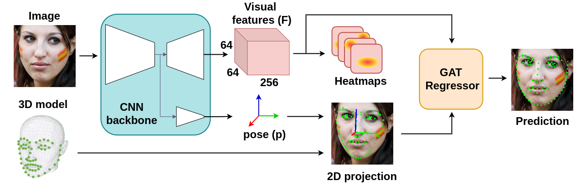

# SPIGA: Shape Preserving Facial Landmarks with Graph Attention Networks.
[](https://colab.research.google.com/github/andresprados/SPIGA/blob/main/colab_tutorials/image_demo.ipynb)
[](https://arxiv.org/abs/2210.07233) 


This repository contains the source code of **SPIGA, a face alignment and headpose estimator** that takes advantage of the complementary benefits from CNN and GNN architectures producing plausible face shapes in presence of strong appearance changes. 

<p align="center">

</p>

**It achieves top-performing results in:**

[](https://paperswithcode.com/sota/pose-estimation-on-300w-full?p=shape-preserving-facial-landmarks-with-graph)
[](https://paperswithcode.com/sota/head-pose-estimation-on-wflw?p=shape-preserving-facial-landmarks-with-graph)
[](https://paperswithcode.com/sota/pose-estimation-on-merl-rav?p=shape-preserving-facial-landmarks-with-graph)
[](https://paperswithcode.com/sota/face-alignment-on-merl-rav?p=shape-preserving-facial-landmarks-with-graph)
[](https://paperswithcode.com/sota/face-alignment-on-wflw?p=shape-preserving-facial-landmarks-with-graph)
[](https://paperswithcode.com/sota/face-alignment-on-300w-split-2?p=shape-preserving-facial-landmarks-with-graph)
[](https://paperswithcode.com/sota/face-alignment-on-cofw-68?p=shape-preserving-facial-landmarks-with-graph)
[](https://paperswithcode.com/sota/face-alignment-on-300w?p=shape-preserving-facial-landmarks-with-graph)


## Setup
The repository has been tested on Ubuntu 20.04 with CUDA 11.4, the latest version of cuDNN, Python 3.8 and Pytorch 1.12.1.
Please install the required dependencies using ```pip install -r requirements.txt``` or any other method.

* **Models:** You can download the model weights from [Google Drive](https://drive.google.com/drive/folders/1olrkoiDNK_NUCscaG9BbO3qsussbDi7I?usp=sharing). By default, they should be stored at ```./models/weights/```.
* **Datasets:** Download the dataset images from the official websites ([300W](https://ibug.doc.ic.ac.uk/resources/facial-point-annotations/), [AFLW](https://www.tugraz.at/institute/icg/research/team-bischof/lrs/downloads/aflw/), [WFLW](https://wywu.github.io/projects/LAB/WFLW.html), [COFW](http://www.vision.caltech.edu/xpburgos/ICCV13/)). By default they should be saved following the next folder structure:

```
./data/databases/   # Default path can be updated by modifying 'db_img_path' in ./data/loaders/dl_config.py
|
└───/300w               
│   └─── /images           
│        | /private     
│        | /test                   
|        └ /train             
|
└───/cofw                   
│   └─── /images
|  
└───/aflw                   
│   └─── /data
|        └ /flickr
|  
└───/wflw
    └─── /images
```

* **Annotations:** We have stored for simplicity the datasets annotations directly in ```./data/annotations```. We strongly recommend to move them out of the repository if you plan to use it as a git directory.
* **Results:** Similar to the annotations problem, we have stored the results in ```./eval/results/<dataset_name>```. Remove them if need it.

***Note:*** All the callable files provide a detailed parser that describes the behaviour of the program and their inputs. Please, check the operational modes by using the extension ```--help```.

## Dataloaders and Benchmarks
The alignment dataloaders and his respective benchmark are located at ```./data``` and ```./eval/benchmark``` respectively.
For more information check the [data readme](./data/readme.md) or the [benchmark readme](./eval/benchmark/readme.md).

## Evaluation
The models evaluation is divided in two scripts:

**Results generation**: The script extracts the data alignments and headpose estimation from the desired ``` <dataset_name>``` trained network. Generating a ```./eval/results/results_<dataset_name>_test.json``` file which follows the same data structure defined by the dataset annotations.

```
python ./eval/results_gen.py <dataset_name>
``` 
 
**Benchmark metrics**: The script generates the desired landmark or headpose estimation metrics. We have implemented an useful benchmark which allows you to test any model using a results file as input. 

```
python ./eval/benchmark/evaluator.py /path/to/<results_file.json> --eval lnd pose -s
``` 

***Note:*** You will have to interactively select the NME_norm and other parameters in the terminal window.

### Results Sum-up
<details>
  <summary> WFLW Dataset </summary>

|[](https://paperswithcode.com/sota/face-alignment-on-wflw?p=shape-preserving-facial-landmarks-with-graph)|NME_ioc|AUC_10|FR_10|NME_P90|NME_P95|NME_P99|
|:--:|:--:|:--:|:--:|:--:|:--:|:--:|
|full|4.060|60.558|2.080|6.766|8.199|13.071|
|pose|7.141|35.312|11.656|10.684|13.334|26.890|
|expression|4.457|57.968|2.229|7.023|8.148|22.388|
|illumination|4.004|61.311|1.576|6.528|7.919|11.090|
|makeup|3.809|62.237|1.456|6.320|8.289|11.564|
|occlusion|4.952|53.310|4.484|8.091|9.929|16.439|
|blur|4.650|55.310|2.199|7.311|8.693|14.421|
</details>
    
<details>
  <summary> MERLRAV Dataset </summary>
    
|[](https://paperswithcode.com/sota/face-alignment-on-merl-rav?p=shape-preserving-facial-landmarks-with-graph)|NME_bbox|AUC_7|FR_7|NME_P90|NME_P95|NME_P99|
|:--:|:--:|:--:|:--:|:--:|:--:|:--:|
|full|1.509|78.474|0.052|2.163|2.468|3.456|
|frontal|1.616|76.964|0.091|2.246|2.572|3.621|
|half_profile|1.683|75.966|0.000|2.274|2.547|3.397|
|profile|1.191|82.990|0.000|1.735|2.042|2.878|
</details>

<details>
  <summary> 300W Private Dataset </summary>
    
|[](https://paperswithcode.com/sota/face-alignment-on-300w-split-2?p=shape-preserving-facial-landmarks-with-graph)|NME_bbox|AUC_7|FR_7|NME_P90|NME_P95|NME_P99|
|:--:|:--:|:--:|:--:|:--:|:--:|:--:|
|full|2.031|71.011|0.167|2.788|3.078|3.838|
|indoor|2.035|70.959|0.333|2.726|3.007|3.712|
|outdoor|2.027|37.174|0.000|2.824|3.217|3.838|
</details>

<details>
  <summary> COFW68 Dataset </summary>

|[](https://paperswithcode.com/sota/face-alignment-on-cofw-68?p=shape-preserving-facial-landmarks-with-graph)|NME_bbox|AUC_7|FR_7|NME_P90|NME_P95|NME_P99|
|:--:|:--:|:--:|:--:|:--:|:--:|:--:|
|full|2.517|64.050|0.000|3.439|4.066|5.558|
</details>

<details>
  <summary> 300W Public Dataset </summary>

|[](https://paperswithcode.com/sota/face-alignment-on-300w?p=shape-preserving-facial-landmarks-with-graph)|NME_ioc|AUC_8|FR_8|NME_P90|NME_P95|NME_P99|
|:--:|:--:|:--:|:--:|:--:|:--:|:--:|
|full|2.994|62.726|0.726|4.667|5.436|7.320|
|common|2.587|44.201|0.000|3.710|4.083|5.215|
|challenge|4.662|42.449|3.704|6.626|7.390|10.095|

</details>
    
## Coming soon...
- [x] Release evaluation code and pretrained models.
- [ ] Project page and demo.
- [ ] Training code.

## BibTeX Citation
If you find this work or code useful for your research, please consider citing:
```
@inproceedings{prados22spiga,
  author = {Andres Prados-Torreblanca and José M. Buenaposada and Luis Baumela},
  title = {Shape Preserving Facial Landmarks with Graph Attention Networks},
  booktitle = {British Machine Vision Conference (BMVC)},
  year = {2022},
  url = {https://arxiv.org/abs/2210.07233}
}
```


